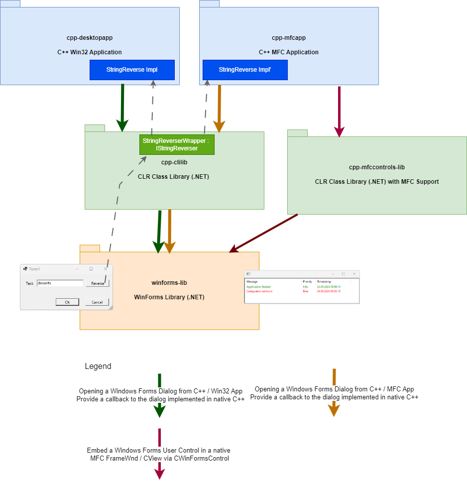

.NET SDK Version is 8.0.302

## Goals
* Evauluation: Is .NET 8 interoperable with native code (e.g. classic C++ and C++/CLI). In particular Windows Forms controls and Win32 Apps / MFC Apps.
* Highlight different interop scenarios, which should be as close as possible to those from productive code.

## Project Structure / Architecture

Three interop scenarios / pathes exist:
* Open up a Windows Forms dialog from a classical Win32 Desktop application. Provide an implemented in native c++ to the dialog and call a method in it (to reverse a string)
* Same, but from an MFC application
* Embed a Windows Forms User Control (a ListView) in an MFC Frame / View



## Project Setup

Try to use dotnet cli whenever possible. Don't use CMake for now to keep things simple.

Create a new directory and make it current:
```bash
mkdir net8-cppcli
cd net8-cppcli
```

Create a WinForms library project `winforms-lib.csproj` in an corresponding subdirectory:
```bash
dotnet new winformslib -o winforms-lib
``` 

This is the generated project file:
```xml 
<Project Sdk="Microsoft.NET.Sdk">
  <PropertyGroup>
    <OutputType>WinExe</OutputType>
    <TargetFramework>net8.0-windows</TargetFramework>
    <RootNamespace>winforms_proj</RootNamespace>
    <Nullable>enable</Nullable>
    <UseWindowsForms>true</UseWindowsForms>
    <ImplicitUsings>enable</ImplicitUsings>
  </PropertyGroup>
</Project>
```

Create a solution and add the project to it:
```bash
dotnet new solution -n net8-cppcli
dotnet sln net8-cppcli.sln add winforms-lib/winforms-lib.csproj
```

Open solution in Visual Studio

Add a  c++/cli library project `cppcli-lib` using the project template  `CLR Class Library (.NET)` (**not** `CLR Class Library (.NET Framework)`). Add a reference from `cppcli-lib` to `winforms-lib`.

Add a  Win32-project `cpp-desktopapp` using the project template `Windows Desktop Application`. Add a reference from  `cpp-desktopapp` to `cppcli-lib`.

We now have the following configuration matrix in our solution:

winforms-lib: `Debug`, `Release` x `AnyCPU`  
cpp-clilib: `Debug`, `Release` x `x64`, `Win32`  
cpp-desktopapp: `Debug`, `Release` x `x64`, `Win32`  

Solution: `Debug`, `Release` x `AnyCPU`, `x64`, `x86`   (`AnyCPU` maps to  `x64` for the c++ projects)  

## Path 1.1: Show a WinForms Dialog on behalf of project `cpp-desktopapp`

Add a new Windows Forms Dialog (e.g. a Form) `Form1` with *Ok*- and *Cancel*-Button to project `winforms-lib`. Make the buttons close the dialog (e.g. set Form Properties `buttonOk`, `buttonCancel` and `DialogResult`-Properties of the buttons). 

```C#
namespace winforms_lib
{
  public partial class Form1 : Form
  {
    ...
  }
}  
```

Now add a function for showing the dialog to project `cppcli-lib`. Note that the header is classical c++:

```c++
bool DLL_CPPCLI_LIB_API ShowWinFormsDialog();
```

`DLL_CPPCLI_LIB_API` needs to be defined as either `__declspec(dllexport)` for project `cppcli-lib` or as `__declspec(dllimport)` for project `cpp-desktopapp`. This avoids unresolved externals.

```c++
using namespace System;

bool ShowWinFormsDialog()
{
  winforms_lib::Form1^ form = gcnew winforms_lib::Form1();
  System::Windows::Forms::DialogResult dialogResult = form->ShowDialog();
  return dialogResult == System::Windows::Forms::DialogResult::OK;
}
```

We also need to add  `../cppcli-lib` as an additional include path to project `cpp-desktopapp`. Now we can include `#include "cppcli-lib.h"` und show the windows forms dialog instead of the *About*-Dialog.
To avoid unresolved externals we also need to set *Linker / General / Ignore Import Library = No* in project `cppcli-lib`.

## Path 1.2: Calling a natively implemented interface from `winforms-lib`

### winforms-lib

Add a new interface for reversing a string:
```C#
public interface IStringReverser
{
  string Reverse(string str);
}
```

Add a property of type `IStringReverser` to the WinForms dialog and call it when the user clicks *Reverse* to reverse the text entered in a text box.

```C#
  public IStringReverser? StringReverser { get; set; }

  private void mButtonReverse_Click(object sender, EventArgs e)
  {
    if (StringReverser != null)
    {
      mTextBox.Text = StringReverser.Reverse(mTextBox.Text);
    }
  }
```

### cpp-desktopapp

Add a new function implementing string reversion for native strings using classical c++:
```c++
std::wstring StringReverse(const std::wstring& str)
{
  wstring result = str;

  // Reverse the string using the reverse() function
  std::reverse(result.begin(), result.end());

  return result;
}
```

### cppcli-lib
Add a wrapper for creating a `IStringReverser` implementation using a given native implementation passed as a `std::function<std::wstring(const std::wstring&)>` (which in fact will be the `StringReverse` function above):

```C++
ref class StringReverserWrapper : winforms_lib::IStringReverser
{
public:
  StringReverserWrapper(std::function<std::wstring(const std::wstring&)>& stringReverser)
    : mStringReverser(stringReverser)
  {}

  virtual System::String^ Reverse(System::String^ str)
  {
    std::wstring nativeString = marshal_as<std::wstring>(str);
    std::wstring nativeStringReversed = mStringReverser(nativeString);
    return marshal_as<System::String ^>(nativeStringReversed);
  }

  std::function<std::wstring(const std::wstring&)>& mStringReverser;
};
```

Create a instance of this wrapper and assign to the WinForms dialog before showing it.

## Path 2: Bring MFC into the game

### Add a MFC project as a second top level project

Add a new MFC App project `cpp-mfcapp` using the projec template *MFC App* with minimal configuration (e.g. no toolbar, no documents, no restart manager, ...). 
Add a dependency from `cpp-mfcapp` to `cppcli-lib`. Like done for `cpp-desktopapp`, add `../cppcli-lib` as include directory and define `DLL_CPPCLI_LIB_API` as `__declspec(dllimport)`.

Now we can show the WinForms dialog the same way we did this in `cpp-desktopapp` (replacing the *About*-Dialog).

## Path 3: Control interop: Use CWinFormsControl to embed a managed control in a MFC  CView

We wnt to add a second C++/CLI interop project, this time using MFC. We want to provide a classical MFC CFrameWnd to the outside while internally embedding a managed control.

### Project setup
Add a second C++/CLI project `cppcli-mfccontrols-lib` from template *CLR Class Library (.NET)*. Set *Use of MFC* to *Use MFC in s Shared DLL*. 
Add a dependency from `cpp-mfcapp` to `cppcli-mfccontrols-lib`. 
Add `..\cppcli-mfccontrols-lib` as an include directory to `cpp-mfcapp`.
Define DLL_CPPCLI_MFCCONTROLS_API both in `cppcli-mfccontrols-lib` and `cpp-mfcapp` as `__decslspec(dllexport)` / `__declspec(dllimport)`. 
To avoid unresolved externals we also need to set *Linker / General / Ignore Import Library = No* in project `cppcli-mfccontrols-lib`.

### Frame and View

Define a hierarchy of frame and view classes in `cppcli-mfccontrols-lib`:

`CFrameWnd`
  `CWindowsFormsControlHostingFrame`  classical C++, exposed to `cpp-mfcapp`
`CView`   
   `CWindowsFormsControlHostingView` classical C++, exposed to `cpp-mfcapp`
      `CWindowsFormsControlHostingViewImpl` yet classical C++, later using `CWinFormsControl`, internal to `cppcli-mfccontrols-lib`

Add a menu entry in `cpp-mfcapp` to open the frame with the view.

### WinForms User Control
Add a user control `winforms_lib::UserControl1` with an embedded ListView to `winforms-lib`.
Add a reference from `cppcli-mfccontrols-lib` to `winforms-lib`

Problem: `afxwinforms.h` uses 

```C++
#using <System.Windows.Forms.dll>
```
which causes an compilation error

```bash
 2>D:\dev\samples\dot.net\net8-cppcli\cppcli-mfccontrols-lib\cppcli-mfccontrols-lib.cpp(5,8): error C1107: could not find assembly 'System.Windows.Forms.dll': please specify the assembly search path using /AI or by setting the LIBPATH environment variable
 ```


Proposed solution was to add 
```xml
<ItemGroup>
    <FrameworkReference Include="Microsoft.WindowsDesktop.App.WindowsForms" />
  </ItemGroup>
```  
to the project file. This didn't fix it. Another solution is  
* search for *System.Windows.Forms* in *External Dependencies* section of the project  
* Open properties for this item and copy the *Full Path*  
* Add this path to *Configuration Properties|C/C++|General|Additional #using Directories*  
This is more a hack than a solution, especially because the absolute pathes may change. 

*karbazol* found a much better solution to this:

Create a new property sheet `cppcli-mfccontrols-lib.props` with the following content:
```xml
<?xml version="1.0" encoding="utf-8"?>
<Project DefaultTargets="Build" xmlns="http://schemas.microsoft.com/developer/msbuild/2003">
  <Target Name="ExtractUsingPath"
			  AfterTargets="ResolveAssemblyReferences"
			  Condition="'$(CLRSupport)'=='NetCore'">
    <ItemGroup>
      <RefList Include="@(ReferencePath->'%(RootDir)%(Directory)')" Condition="'%(ReferencePath.NuGetPackageId)'=='Microsoft.WindowsDesktop.App.Ref'  And 
                                   '%(ReferencePath.FileName)'=='System.Windows.Forms'"></RefList>
      <ClCompile>
        <AdditionalUsingDirectories>@(RefList);%(ClCompile.AdditionalUsingDirectories)</AdditionalUsingDirectories>
      </ClCompile>
    </ItemGroup>
  </Target>
</Project>
```

In the project file add a ItemDefinitionGroup like this ...
```xml
  <ItemDefinitionGroup>
    <ClCompile>
        <AdditionalUsingDirectories>$(ReferencePath);%(AdditionalUsingDirectories)</AdditionalUsingDirectories>
    </ClCompile>
  </ItemDefinitionGroup>
```
and import the property sheet ...
```xml
  <Import Project="cppcli-mfccontrols-lib.props" />
```

We may also want to add
```xml
    <UseWindowsForms>true</UseWindowsForms>
```

to the "Globals" PropertyGroup, but it is not sure if this is absolutely required for compilation.


Second problem: Now the program compiles, but crashes when trying to open the embedding frame / view.
Solution: Added `WinFormsControlSiteSafe.hpp` from productive code base and derived `CWindowsFormsControlHostingViewImpl` from `CWinFormsHostWnd_NoOleException`. Also had to copy and paste the base class implementation of `CreateOrLoad` to `CWinFormsHostWnd_NoOleException`.


## Links

[https://learn.microsoft.com/en-us/dotnet/core/porting/cpp-cli]()
[https://learn.microsoft.com/en-us/dotnet/core/porting/]()  
[https://thebuildingcoder.typepad.com/blog/2024/04/migrating-from-net-48-to-net-core-8.html]()
[https://stackoverflow.com/questions/69927375/is-it-possible-to-use-cwinformscontrol-afxwinforms-h-in-a-c-cli-project-target]()  
[https://github.com/dotnet/winforms/issues/11517]()  

### CMake

[https://cmake.org/cmake/help/latest/prop_tgt/COMMON_LANGUAGE_RUNTIME.html]()  
CMAKE_MFC_FLAG ?
